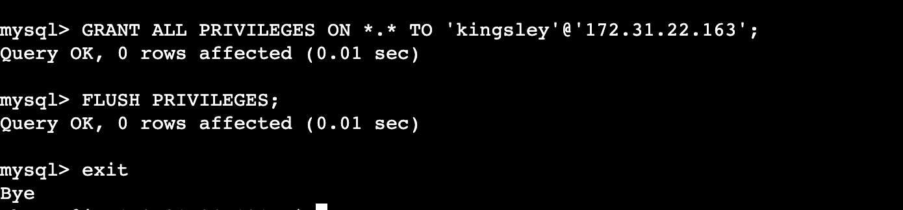

# Understanding Client-Server Architecture with MySQL as RDBMS
Client-Server Architecture with MySQL as the Relational Database Management System (RDBMS) is a system where multiple computers (clients) interact with a dedicated computer (server) to store and retrieve structured data managed by MySQL. The server acts as a centralized data organizer, while clients can request, modify, or add information based on MySQL's rules. This setup is commonly used in web applications to ensure efficient data management and access.

## Client-Server Architecture
Client-Server Architecture is like teamwork in computers. Clients ask for things, and servers give them. It helps organize how computers work together, making things efficient and easy to manage on a network.

A simple example of Client-Server interaction is shown below:

`curl -Iv www.propitixhomes.com`

Client: In this case, my local broser acts as the client, and is responsible for initiating the communication, making requests to a server, and receiving responses. The client uses thee curl command to achieve this interaction.

Server: The server, in this case, is the web server that hosts the website www.propitixhomes.com. It is responsible for listening to incoming requests, processing those requests, and sending back responses. The IP address "75.2.115.196" and port 80 are the server's address and port where the server is listening for incoming HTTP requests.

`-I` This option tells curl to send an HTTP HEAD request, which requests only the headers of the web page and not the full content. It is often used to check for server response and header information without downloading the actual page content.

`-v` This option stands for "verbose" and tells curl to be more verbose, providing additional information about the request and response, including progress details, request headers, and response headers.

So, when you run this command, curl sends an HTTP HEAD request to www.propitixhomes.com and displays the response headers in a verbose manner. This is useful for checking the HTTP headers of a web page, which can provide information about the server, content type, response status, and other important metadata without downloading the entire page content.

This output is the verbose output of the curl command when you run curl -Iv www.propitixhomes.com. It shows the various stages of the HTTP request being made. Here's a breakdown of the output:

> Trying 75.2.115.196:80...: curl is attempting to connect to the IP address 75.2.115.196 on port 80. This is the initial step where it establishes a connection with the web server.

> Connected to www.propitixhomes.com (75.2.115.196) port 80 (#0): The connection to www.propitixhomes.com at the specified IP address and port 80 is established, and curl has assigned it the identifier "0" for this request.

> HEAD / HTTP/1.1: This line shows the HTTP request being sent. It's a HEAD request for the root path ("/") using HTTP version 1.1.

> Host: www.propitixhomes.com: This is part of the HTTP request header, specifying the "Host" header with the hostname of the website you're accessing.

> User-Agent: curl/7.81.0: This is another part of the HTTP request header, indicating the user-agent string, which identifies the client making the request. In this case, it's curl version 7.81.0.

> Accept: */*: This part of the HTTP request header specifies that the client (curl) can accept any type of content ("/").

## Implement a Client Server Architecture using MySQL Database Management System (DBMS)
To implement a Client-Server Architecture using the MySQL Database Management System on AWS EC2 instances, you would create and configure two Linux-based virtual servers, one designated as the "MySQL Server" and the other as the "MySQL Client." The "MySQL Server" hosts the MySQL database, while the "MySQL Client" connects to this server to send and retrieve data through SQL queries. This architecture accommodates multiple clients, such as applications or other servers, to concurrently access and manipulate the database, providing a scalable and robust solution for data storage and retrieval in an AWS environment.

### a. Create and configure two Linux-based virtual servers in AWS, one named "MySQL Server" and the other "MySQL Client".

### b. Install MySQL on the "MySQL Server" instance and configure it as the database server. 
* Update the package list on your Ubuntu Instance:`sudo apt update` 
* Install the MySQL server on your Ubuntu Instance: `sudo apt install mysql-server`

* Initiate the MySQL secure installation process and answer the relevant questions to your requirements: `sudo mysql_secure_installation`
* Start the MySQL client as the MySQL root user: `sudo mysql -u root`

* Configured MYSQL to use the 'mysql_native_password' authentication method to set the password to 'your-new-password:
`'ALTER USER 'root'@'localhost' IDENTIFIED WITH 'mysql_native_password' BY 'your-new-password';`
* Flush Privileges to ensure that the changes take effect:`FLUSH PRIVILEGES;`
* exit mysql: `exit`

* On the MySQL Server, login to mysql as root user and put in your password: `mysql -u root -p`
* Create the MySQL User with your desired password for user.
`CREATE USER 'kingsley'@'CLIENT-PRIVATE-IP' IDENTIFIED BY 'Password-for-Client-User-kingsley';`
* Grant the necessary privileges to the client user. For example, to grant all privileges on all databases:

`GRANT ALL PRIVILEGES ON *.* TO 'kingsley'@'172.31.22.163';`
* Flush Privileges to ensure that the changes take effect:`FLUSH PRIVILEGES;`
* exit mysql: `exit`

* Restart mysql: `sudo systemctl restart mysql`
* Check the status of the MySQL service: `sudo systemctl status mysql`

### c. Set up the "MySQL Client" instance to connect to the server to send and retrieve data.
* Update the package list on your Ubuntu:`sudo apt update` 
* Install the MySQL Client on your Ubuntu Instance: `sudo apt install mysql-client`

* Check if MySQL Client is installed: `mysql --version`

### d. To allow external access to your MySQL server, create a new inbound rule in the security group associated with your MySQL server to open TCP port 3306
For security reasons, it's essential to restrict access to your MySQL server to only allow connections from the specific local IP address of your MySQL client.

### e. Configure MySQL server to allow connections from remote hosts.
* Open the MySQL Configuration File for editing: `sudo vi /etc/mysql/mysql.conf.d/mysqld.cnf`
* Replace '127.0.0.1' to '0.0.0.0' like this: 

* View the edited contents of MySQL Configuration File`sudo vi /etc/mysql/mysql.conf.d/mysqld.cnf `

### f. From mysql client Linux Server connect remotely to mysql server Database Engine
* Connect to MySQL server from client machine using the MySQL client: `mysql -u kingsley -h client-private-IP -p`

### g. Check that you have successfully connected to a remote MySQL server and can perform SQL queries
* `Show databases;` : This list all the databases on a MySQL server

* `USE information_schema`: This change the active database to the information_schema
* `SHOW TABLES;`: This will show us what tables are available within our schema (information_schema):

# Congratulations you have successfully installed, configured, and remote connected a MYSQL SERVER!!!
